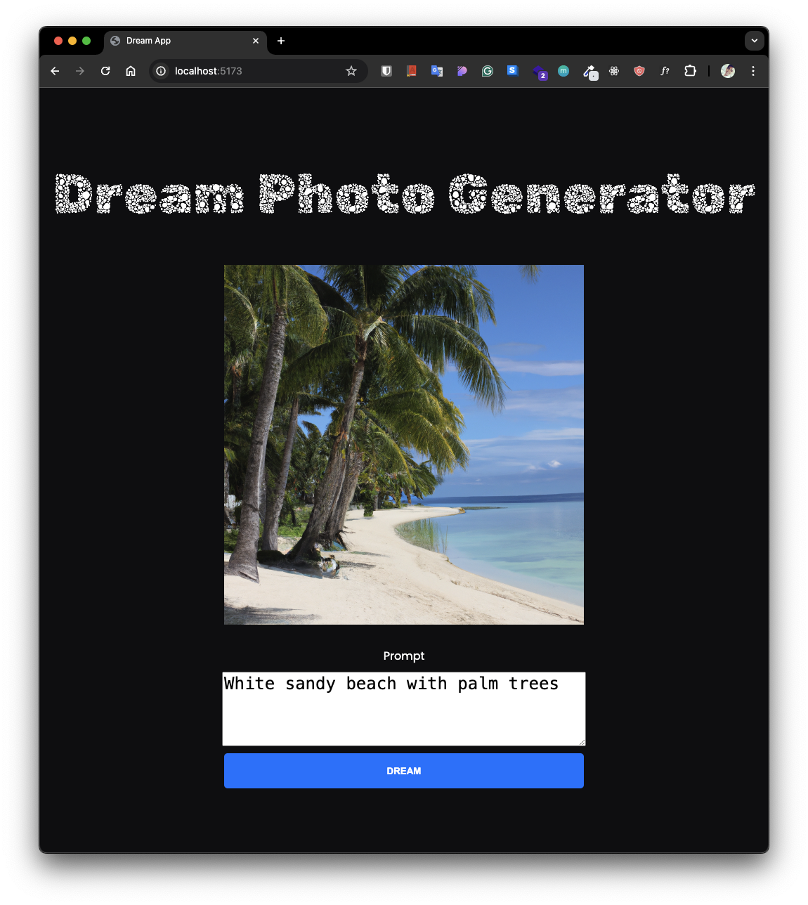

# Image-AI

## Image Generator Using DALL·E API




This repository hosts an application that allows users to generate images from text prompts using OpenAI's DALL·E API. It features a user-friendly interface for both the initiation of image generation and the display of resulting artwork.

## Features

- Generate images through text prompts.
- User-friendly frontend interface.
- Backend integration with OpenAI's DALL·E API.

## Prerequisites

Ensure you have [Node.js](https://nodejs.org/) installed to handle package management and server operations. You will also need an OpenAI account, a token within a .env file to run this properly.

## Installation

Clone the repository:

```bash
git clone git@github.com:b-jacobe/Image-AI.git
cd Image-AI
```

Install dependencies:

```bash
npm install
```

## Running the Application

To run the front end locally:

```bash
npm run dev
```

This will start the Vite development server and load the frontend on http://localhost:[yourport#]

To run the backend server:

```bash
node server.js
```

The backend will start and listen for requests to perform API calls to OpenAI.

## Usage

Once both servers are running, navigate to http://localhost:[yourport#] on your browser to use the application. Enter your desired prompt and generate images.

## License

This project is licensed under the MIT License - see the LICENSE.md file for details.
